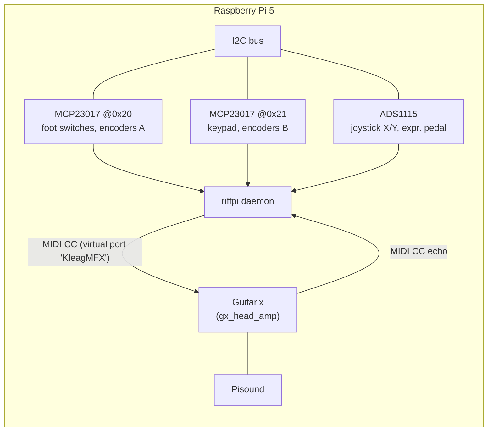
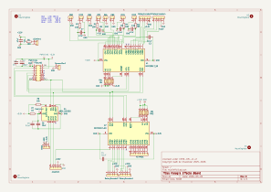
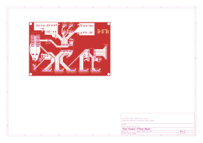
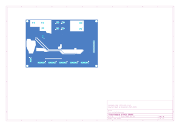

# Architecture

RiffPi is a small Python daemon that reads a set of physical controls on the pedalboard and
turns them into MIDI Control Change (CC) and Program Change messages sent to
[Guitarix](https://guitarix.org/) over a virtual MIDI port.

It's installed as the `riffpi` command (CLI dispatch in `riffpi.cli:main`). Running `riffpi` (or
`riffpi run`) starts the daemon itself (`riffpi.daemon:run`); `riffpi install-service` /
`riffpi uninstall-service` manage the `systemd --user` service — see
[Installation](installation.md).

## Hardware overview

Everything is wired to the Raspberry Pi over a single I2C bus:

- Two **MCP23017** 16-bit GPIO expanders (`0x20` and `0x21`) provide the digital I/O for the 4
  foot switches + LEDs, the 4 rotary encoders (with their push buttons), the 4x4 matrix keypad,
  and the joystick's push button.
- One **ADS1115** 4-channel ADC reads the two analog joystick axes and the expression pedal.
- A [Pisound](https://blokas.io/pisound/) sound card provides the audio interface and, via
  PipeWire, the MIDI bridge to Guitarix running on the same Raspberry Pi 5.

### MCP23017 pin map

Pin numbers are the Adafruit CircuitPython MCP23017 numbering (`A0`-`A7` = 0-7, `B0`-`B7` = 8-15).

| Control | MCP | Pins |
|---|---|---|
| Power LED | `0x20` | B3 (11) |
| Foot switch 0 / LED 0 | `0x20` | button B6 (14), LED B5 (13) |
| Foot switch 1 / LED 1 | `0x20` | button B7 (15), LED B4 (12) |
| Foot switch 2 / LED 2 | `0x20` | button A6 (6), LED A4 (4) |
| Foot switch 3 / LED 3 | `0x20` | button A7 (7), LED A5 (5) |
| Rotary encoder 0 | `0x20` | clk A0 (0), dt B0 (8), sw B1 (9) |
| Rotary encoder 1 | `0x20` | clk A3 (3), dt A2 (2), sw A1 (1) |
| Rotary encoder 2 | `0x21` | clk B7 (15), dt B6 (14), sw B5 (13) |
| Rotary encoder 3 (preset) | `0x21` | clk B4 (12), dt B3 (11), sw B2 (10) |
| Joystick push button | `0x20` | B2 (10) |
| Keypad rows | `0x21` | 0-3 |
| Keypad columns | `0x21` | 4-7 |

### ADS1115 channel map

| Signal | Channel |
|---|---|
| Joystick X | P0 |
| Joystick Y | P1 |
| Expression pedal | P2 |

## Software architecture

`riffpi.daemon.run()` does all hardware/MIDI setup, then starts one daemon thread per input
device plus a MIDI-input listener thread, and blocks on `signal.pause()`:

- `midi_input_thread` — listens on the same virtual MIDI port for CC echoes coming back from
  Guitarix (e.g. after a preset change alters effect state) and re-syncs local LED/encoder state.
- `buttons_thread` — polls the 4 foot switches (debounced via `MCPButton`).
- `joystick.poll_joystick` — reads the ADS1115, emits relative mouse motion via `uinput`.
- `keypad.keypad_thread` — scans the 4x4 matrix keypad.
- `expression_pedal.poll` — reads the ADS1115, sends smoothed CC24 values.
- one `rotary_encoder.poll_thread` per encoder — quadrature decoding + CC deltas.
- `main_thread_loop` — drains `task_queue` (currently only the `"reset"` action queued by the
  keypad when switching preset banks).

Foot switch buttons and every encoder's built-in push button route through the same
`handle_effect_toggle(idx)` callback. The **last** encoder is special-cased as the preset-bank
selector (cycles Guitarix banks A-D) instead of toggling an effect.

`i2c_lock` (a `threading.Lock`) guards ADS1115 reads shared between the `Joystick` and
`ExpressionPedal` threads, since both poll the same `ADS1115` instance concurrently.

### Driver modules

| Module | Responsibility |
|---|---|
| `riffpi.rotary_encoder` | Quadrature decoding (transition lookup table) → relative MIDI CC deltas |
| `riffpi.keypad` | 4x4 matrix scan; digit-buffer preset entry; `*`/`#` as mouse left/right click |
| `riffpi.joystick` | ADS1115 → dead-zone/power-curve shaped relative mouse motion (see [Usage](usage.md)) |
| `riffpi.expression_pedal` | ADS1115 → median-smoothed MIDI CC24 |
| `riffpi.mcp_button` / `riffpi.mcp_led` | Thin per-pin MCP23017 button/LED wrappers |

See [Usage](usage.md) for the full MIDI CC mapping and what each control does.

## PCB and schematic

Board design source lives in `kicad_board/` (KiCad 9). Exported views:

